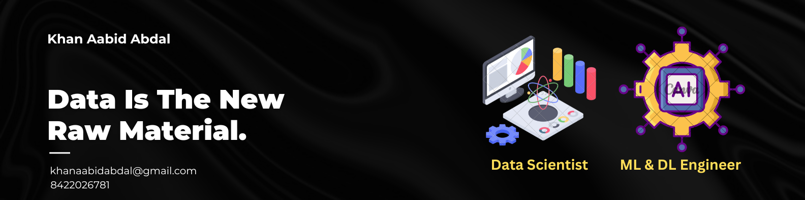

# Khan Aabid Abdal

## About Me

Hello! I am Khan Aabid Abdal, a passionate Data Scientist and Machine Learning Engineer who has completed my M.Sc. in Artificial Intelligence. My work primarily revolves around leveraging machine learning and deep learning techniques to derive insights and build intelligent solutions.

## Contact Information

- **Location:** Kalyan, Maharashtra, India
- **Email:** [khanaabidabdal@gmail.com](mailto:khanaabidabdal@gmail.com)
- **LinkedIn:** [Aabid Abdal Khan](https://www.linkedin.com/in/aabid-abdal-khan/)
- **Twitter:** [@KhanAabidAbdal](https://x.com/KhanAbdalAabid)
- **Kaggle:** [khanaabidabdal](https://www.kaggle.com/khanaabidabdal)

## Skills

- **Programming Languages:** Python, R
- **Machine Learning & Deep Learning:** Scikit Learn, TensorFlow, PyTorch
- **Data Analysis & Visualization:** Pandas, NumPy, Seaborn, Matplotlib, Plotly
- **Database Management:** MySQL, SQL
- **Tools:** Microsoft Office, Excel, Word
- **Other Skills:** Canva, PPT Presentation, Video & Photo editing, SEO.

## Certifications

- **Machine Learning with Python: Zero to GBMs** by Jovian
- **Data Analysis with Python: Zero to Pandas** by Jovian
- **Data Scientist Career Track** by 365 Data Science
- **PyTorch For Deep Learning in 2023: Zero To Mastery** by Udemy
- **SQL Basic** by LearnSQL.com
- **Deep Learning with TensorFlow 2** (LinkedIn)
- **Artificial Intelligence Foundations: Neural Networks** (LinkedIn)
- **Python for Data Science Essential Training** (LinkedIn)
- **Advanced Microsoft Excel** by 365 Data Science
- **Statistics** by 365 Data Science

## Languages

- **Arabic:** Limited Working Proficiency
- **English:** Limited Working Proficiency
- **Urdu:** Limited Working Proficiency
- **Marathi:** Elementary Proficiency
- **Hindi:** Native or Bilingual Proficiency

## Experience

### MeriSKILL
- **Data Analyst Intern**
  - Duration: September 2023 - October 2023
  - Created a Sales Dashboard On Excel
  - Created a Model for the prediction of Diabetes

### Rio 125 Internship (TCS ION)
- Duration : September 2023 - December 2024
- Worked on NLP Model
- Created a model for detection and correction of grammatical errors using the t5 base model

## Education

| Degree                            | Institution                      | Duration                | Grade/Percentage      |
|-----------------------------------|----------------------------------|-------------------------|-----------------------|
| M.Sc. in Artificial Intelligence  | B.K. Birla College (Autonomous)  | Aug 2022 - July 2024    |       Pending         |
| B.Sc. in Physics                  | B.K. Birla College (Autonomous)  | June 2019 - April 2022  |         9.8           |
| 12th H.S.C Board (Science)        | R.K. Talreja College             | July 2017 - Feb 2019    |         77%           |
| 10th S.S.C Board                  | Old Boays Associaltion English High School | Aug 2009 - Mar 2017 |   83%           |

  ## Projects

  - **Ai Image Classifier : Fake Vs Real Faces** : Developed a robust computer vision model aimed at distinguishing between real and AI-generated faces. Leveraged the ResNet50 architecture for both feature extraction and fine-tuning to enhance classification accuracy. The project involved:

     Implementing the model in Google Colab with a free GPU for training and testing.
    
     Designing an interactive user interface using Gradio for image upload and classification.
    
     Achieving a peak accuracy of 98% through fine-tuning with real-world data augmentation.
    
     Addressing overfitting and stability issues by experimenting with different training epochs.
    
     Deploying the application on Hugging Face for real-time classification.
    
     Submitting the research findings to Discover Artificial Intelligence, Springer Nature.
    
     Key Technologies: Python, PyTorch, ResNet50, Google Colab, Gradio, Hugging Face
    
     [Hugging Face link](https://huggingface.co/spaces/khanaabidabdal/RealityCheck) | [GitHib Repository](https://github.com/khanaabidabdal/Ai-Image-Classifier-Real-Vs-Fake-Faces?tab=readme-ov-file)

- **Comprehensive Analysis of Bike Store Database** : This project focuses on analyzing a comprehensive dataset from a bike store, which includes information about customers, orders, products, stores, and staff. The analysis aims to uncover insights into customer behavior, sales performance, product trends, and staff efficiency.[GitHub Repositry](https://github.com/khanaabidabdal/Comprehensive-Analysis-of-Bike-Store-Database)

- **Fruitify**: This project classifies 100 different types of fruits with 80% accuracy and is deployed on Hugging Face. [GitHub Repository](https://github.com/khanaabidabdal/Fruitify) | [Hugging Face Space](https://huggingface.co/spaces/khanaabidabdal/fruitify)

- **Nobel Prize Insights**: Conducted in-depth analysis of Nobel Prize data to extract key insights using pandas, matplotlib, and seaborn.[Project Link](https://jovian.com/khanaabidabdal/nobel-prize-insight)

- **Spam Classification**: Trained models, including Logistic Regression, PyTorch, and Naive Bayes, for classifying SMS as spam or ham.

- **Movie Genre Classification**: Developed a model to categorize movies into 17 different genres.

## Honors and Awards

- **Fizi-Talks**

## Summary

I am an enthusiastic AI professional with a robust background in machine learning, deep learning, and data analysis. My academic and professional experiences have equipped me with the skills necessary to tackle complex data-driven challenges and contribute to innovative projects. I am always eager to learn and share knowledge, which has led me to write articles and create educational content on platforms like YouTube in past.

---

Feel free to explore my repositories and connect with me on [LinkedIn](https://www.linkedin.com/in/aabid-abdal-khan/).

